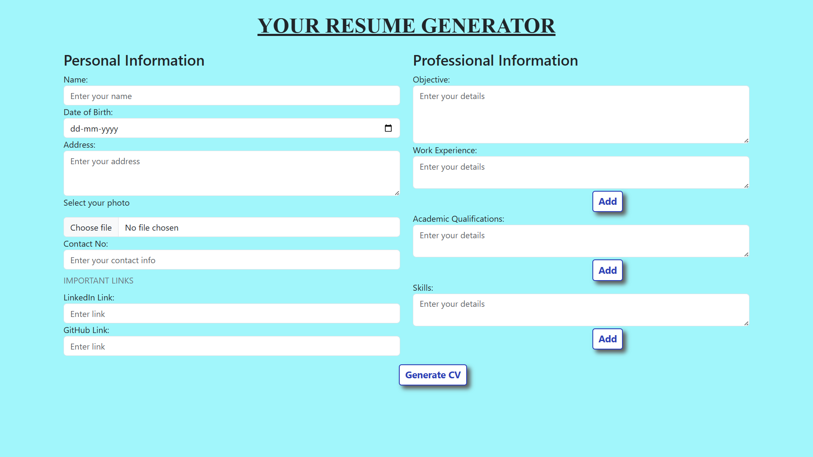
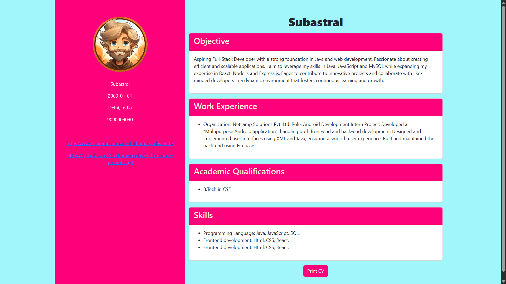

# 🌟Resume Generator🗒️

A sleek and interactive **Resume Generator** built with **HTML**, **CSS**, **JavaScript**, and **Bootstrap**. This project allows users to create professional Resume's effortlessly with a live preview and print option. 🚀

## 📋 Table of Contents

- [📸 Screenshots](#-screenshots)
- [🚀 Live Demo](#-live-demo)
- [✨ Features](#-features)
- [🛠️ Technologies Used](#️-technologies-used)
- [📂 Project Structure](#-project-structure)
- [🌟 How to Use](#-how-to-use)
- [📈 Future Enhancements](#-future-enhancements)
- [🤝 Contributing](#-contributing)
- [📜 License](#-license)
- [📬 Contact](#-contact)

## 📸 Screenshots
&nbsp;&nbsp;


## 🚀 Live Demo
Click the link below to try the Resume Generator instantly:

🔗 [Resume Generator Live Demo](https://resume-generator-rouge.vercel.app)

## ✨ Features

- 📝 **Personal Information**: Add your name, date of birth, address, contact number, and profile photo.
- 💼 **Professional Information**: Add your objective, work experience, academic qualifications, and skills.
- ➕ **Dynamic Fields**: Add multiple entries for work experience, academic qualifications, and skills dynamically.
- 👀 **Live Preview**: View the generated Resume in real-time.
- 🖨️ **Print Option**: Print the generated Resume directly from the browser.
- 📱 **Responsive Design**: Fully responsive and mobile-friendly layout using **Bootstrap**.

## 🛠️ Technologies Used

- **HTML5**: For the structure of the application.
- **CSS3**: For styling, including custom styles and animations.
- **JavaScript**: For dynamic functionality like adding fields and generating the Resume.
- **Bootstrap 5**: For responsive design and pre-styled components.

## 📂 Project Structure
    resume-generator/ 
    ├── index.html # Main HTML file 
    ├── style.css # Custom CSS styles 
    ├── script.js # JavaScript functionality


## 🌟 How to Use

1. Clone the repository:
   ```bash
   git clone https://github.com/AlokKumarYadav2410/resume-generator.git

2. Navigate to the project directory:
   ```bash
   cd resume-generator

3. Open index.html in your browser to start using the Resume Generator.

## 📈 Future Enhancements
- 🖨️ Add support for saving the Resume as a PDF.
- 🎨 Include more customization options for the Resume template.

## 🤝 Contributing
- Contributions are welcome! 🎉 If you'd like to contribute, please fork the repository and submit a pull request.

## 📜 License
- This project is licensed under the **MIT License**. See the [LICENSE](LICENSE) file for details.

## 📬 Contact
- For any inquiries or feedback, feel free to reach out:

    - 📧 Linkedin: [ALOK KUMAR YADAV](https://www.linkedin.com/in/alokkumaryadav2410) 
    - 🐙 GitHub: [AlokKumarYadav2410](https://github.com/AlokKumarYadav2410)
 
---
**🎉 Enjoy Generating professional Resume with ease!!!**
